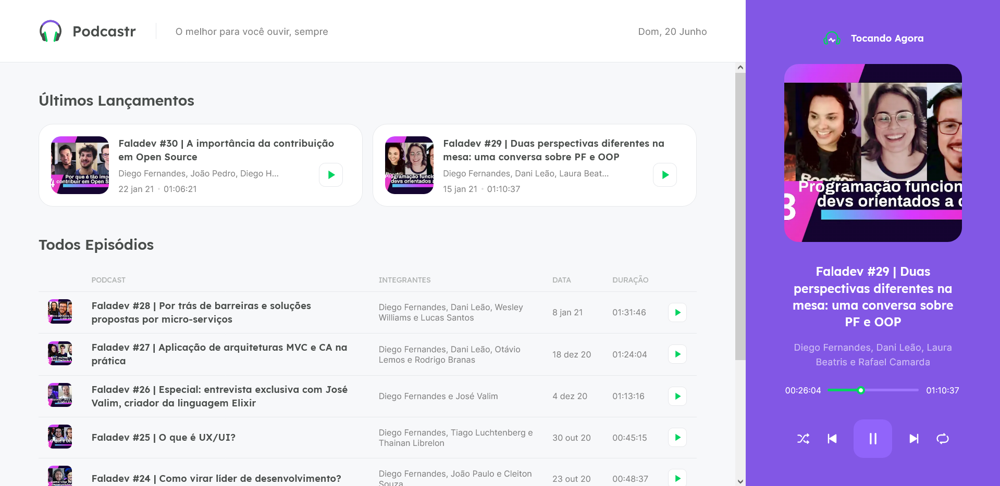
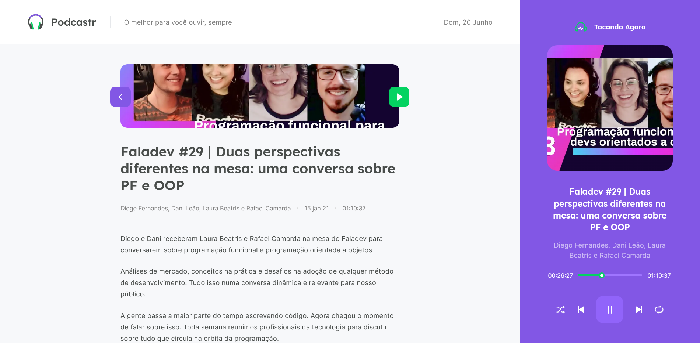

<h1 align="center">🎲 NLW5 Podcastr</h1>
<p align="center">☕ Esse projeto foi desenvolvido durante a trilha de ReactJS na quinta edição da NLW, consiste em uma plataforma e um player responsável pela listagem e reprodução de episódios de podcasts</p>

<p align="center">
    
    
</p>

# 🛠 Tecnologias usadas

- [ReactJS](https://reactjs.org)
- [Next.js](https://nextjs.org/)
- [TypeScript](https://www.typescriptlang.org/)
- [SASS](https://sass-lang.com/)
- [JSON Server](https://github.com/typicode/json-server)

# Criando o projeto

### Requisitos

- Node.js
- Next.js

### ⚙️ Como rodar a aplicação

```bash
# Clone este repositório
$ git clone https://github.com/Felipe-Macario/nlw5-podcastr.git

# Instale as dependências
$ yarn

# Inicie a API falsa com o JSON Server
$ yarn server 

# Execute a aplicação em modo de desenvolvimento em um novo terminal
$ yarn dev
```

O servidor iniciará na porta 3000, para acessar a aplicação utilize a url [`https://localhost:3000`](https://localhost:3000)

## 🚕 Créditos

- Projeto seguindo a orientação de [Rocketseat](https://rocketseat.com.br/)
- Layout no [Figma](https://www.figma.com/file/UwFEntsHpHYJlHNQAQr4gA/Podcastr)

## 📄 Licença

Esse projeto está sob a licença MIT. Veja o arquivo [LICENSE](LICENSE.md) para mais detalhes.